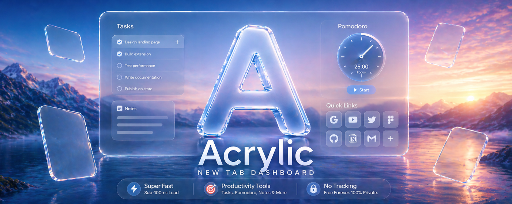

# Acrylic — New Tab

[](https://chromewebstore.google.com/detail/acrylic-new-tab/cfoafjghblbnolmmkglboeddfpohjihi?authuser=0&hl=en-GB)
[](https://addons.mozilla.org/en-US/firefox/addon/acrylic-new-tab/)
[](https://developer.chrome.com/docs/extensions/develop/migrate/what-is-mv3)
[](https://developer.mozilla.org/en-US/docs/Web/JavaScript/Guide/Modules)
[](./PRIVACY_POLICY.md)
[](./LICENSE)

<div align="center">
  
</div>

A clean, frosted-glass new tab page built with vanilla web technologies. Sub-100ms load times, zero analytics, zero paywalls, and a focused productivity toolkit right when you open a new tab.

<div align="center">
  <br>
  <a href="https://chromewebstore.google.com/detail/acrylic-new-tab/cfoafjghblbnolmmkglboeddfpohjihi">
    
  </a>
  <br>
  <i>Free and open-source for Google Chrome, Mozilla Firefox, Microsoft Edge, and Brave.</i>
  <br><br>
</div>

---

## Table of Contents

- [Acrylic v2.0.0 — Roadmap](#-acrylic-v200--roadmap)
- [What's New in v1.2.4 — 2026-08-16](#-whats-new-in-v124---2026-08-16)
- [Why Acrylic?](#-why-acrylic)
- [Architecture vs. Competitors](#-architecture-vs-competitors)
- [Features](#-features)
- [Keyboard Shortcuts](#️-keyboard-shortcuts)
- [Tech Stack](#️-tech-stack)
- [Frequently Asked Questions (FAQ)](#-frequently-asked-questions-faq)
- [Manual Installation & Verification](#️-manual-installation--verification)
- [Community & Feedback](#-community--feedback)

---

## 🗺️ Acrylic v2.0.0 — Roadmap

*Acrylic's biggest release yet — turning the new tab from a dashboard into a full focus environment. Site blocking, a to-do list deep enough to replace your task app, real productivity reports, ambient soundscapes, and wallpapers that follow the time of day.*

> [!NOTE]
> Everything listed as **🟢 Free** ships free for all users forever. Features marked **✨ Pro** will be available with **Acrylic Pro**, launching with v2.0.0. All existing v1.x features remain 100% free and untouched.

### 🟢 Free for Everyone in v2.0.0

#### 🚫 Site Blocker
Block distracting websites right from your new tab, or flip on **Deep Focus** to block everything except an allowlist. Set focus hours to auto-block on a schedule, or have blocking activate automatically when your Pomodoro starts. Free tier covers **5 blocked sites**.

#### ⏱️ Pomodoro Presets & Improvements
Choose from **Classic 25/5**, **Lock-In 50/10**, and **Rhythm 90/20** presets, plus fully custom durations — free for everyone. The timer ring, mini widget, and popup now always stay in sync.

#### 📊 Productivity Stats
Focus time, sessions, and completed tasks are recorded automatically with a daily goal and streak tracker. Time-per-website tracking is **strictly opt-in**, stores only the site name, and never leaves your device.

#### 🌅 Time-of-Day Wallpaper Packs
Curated wallpaper packs that shift from morning to day to evening to night. **Natural Light** pack is free. A pack never overwrites your own wallpaper — turn it off and yours comes straight back.

#### 📋 Clipboard History (Mounted)
The clipboard history panel (auto-captures last 20 copied text snippets with pin, copy, and delete) is now accessible in Quick Tools.

---

### ✨ Acrylic Pro Exclusives in v2.0.0

#### 🚫 Unlimited Site Blocking (Pro)
Unlimited blocked sites (free tier caps at 5). Block entire categories or use wildcard patterns.

#### ✅ To-Do Depth (Pro)
Due dates, times, reminders, repeating tasks, and priority levels. Finishing a repeating task auto-creates the next occurrence so habits build a real history. Overdue tasks turn red and move to the top without ever nagging you.

#### 📈 Focus Reports (Pro)
Weekly and monthly views of your focus time, sessions, and tasks with insights on your best hours, strongest weekday, habit streaks, and **PDF export**.

#### 🌊 Time-of-Day Wallpaper Packs — Premium Collections (Pro)
**Coastal**, **Metropolis**, and **Ambient** wallpaper packs that shift with the time of day. Free users get **Natural Light** only.

#### 🎬 Curated 4K Dynamic Motion Video Loops (Pro)
Hand-picked 4K motion video loops (abstract gradients, northern lights, flowing water, city timelapse) streamed from a curated gallery with poster thumbnails. Free users can still upload their own videos — only the curated gallery is Pro.

#### 🎧 Multi-Track Ambient Soundscape Mixer (Pro)
Layer simultaneous ambient audio tracks — Rain, Café, Lo-Fi, Fireplace, Ocean Waves, Wind — with individual volume sliders and a master control. Free users keep the standard Pomodoro chime sounds.

#### 🎨 Deep Theme Architect (Pro)
Unlock custom glass panel styling with live sliders: blur radius (8px–32px), backdrop saturation (0.5–2.5), tint color via hex picker, and tint opacity (0–50%). Free users keep the 8 built-in preset themes.

#### 📊 Productivity Heatmaps (Pro)
GitHub-style weekly focus heatmap grid (90 days of history) with color intensity scaling by session count. Summary stats: *"This week: 14 sessions · Best streak: 5 days"*. Free users see today's count only.

#### 🗂️ Advanced Workspaces — Unlimited Saved Tab Groups (Pro)
Save unlimited tab group workspaces with naming and organization. Free users can save up to 3 groups.

#### 📋 Extended Clipboard History — 100 Items (Pro)
Clipboard history expands from 20 to 100 items for Pro users, with the same pin, copy, and delete interface.

#### ✨ Golden Glass Supporter Badge (Pro)
A shimmering golden badge displayed next to your name in Settings as a thank-you for supporting indie development.

#### 🖼️ Screenshot Editor Additions (Pro)
A blending highlighter that keeps text readable, auto-incrementing step numbers for walkthroughs, and a watermark applied at export across PNG, JPEG, PDF, and clipboard.

---

> [!NOTE]
> **Acrylic Pro** launches with v2.0.0. All existing free features will **never** be paywalled — Pro is purely additive, bringing aesthetic and power-user enhancements on top of the same fast, private, zero-telemetry core.

---

## 🎉 What's New in v1.2.4 — 2026-08-16

*Focus: Seamless background transitions and visual polish.*

### Fixed
- **Cross-Mode Background Transitions:** Resolved a visual glitch where switching between solid palettes and image wallpapers caused a harsh black flash. This was completely rewritten to use a cinematic ghost-overlay crossfade, ensuring perfect smoothness with zero black bleed-through.

---

## What's New in v1.1.4 — 2026-08-15

*Focus: Interaction reliability, URL validation robustness, ambient media, and security.*

### Added
- **Local Media Wallpapers:** Users can now upload local video loops (`.mp4`, `.webm`) or images up to ~50MB directly from their device to use as ambient backgrounds. Files are stored efficiently and privately in the browser's native IndexedDB.
- **Wallpaper Settings Overhaul:** The settings panel was redesigned to feature a modern, dashed-border upload dropzone for local media, and a streamlined input layout for image URLs.

### Fixed
- **Quick Links Double-Click Bug:** Resolved a race condition where transferring window focus from the browser Omnibox triggered an unconditional DOM teardown of quick link tiles mid-click. Fixed by implementing deterministic `renderSignature` diffing in `quicklinks.js`.
- **Top Sites Render Optimization:** `refreshTopSites()` now deep-compares incoming data and skips the expensive `renderLinks()` call if nothing changed.
- **Quick Links URL Rejection:** Resolved an issue where saving protocol-less URLs (e.g. `youtube.com/watch?v=...` or `youtu.be`) would silently fail. Changed to `type="text"` to allow the custom sanitizer to correctly prepend `https://`.
- **Localhost and IP Domain Support:** Removed the `.` (dot) requirement from the Quick Links URL validator. Users can now save `localhost:8080`, IPs, and short domains.
- **Search Bar Navigation Unaffected:** URL validation logic was bifurcated. The search bar retains its original dot-requiring heuristic, ensuring `localhost` still triggers a web search.
- **Wallpaper URL Robustness:** Rewrote `normalizeWallpaperUrl` to use the same `sanitizeUrl()` + `isValidUrl()` pipeline as Quick Links.
- **YouTube Wallpaper Detection:** Reverted the YouTube iframe detection logic to the stable v1.1.2 approach since YouTube's strict CSP now permanently blocks `postMessage` communication to `chrome-extension://` origins. Removed broken mute button logic.

### Security
- **XSS Prevention in Custom Links:** Patched a vulnerability where `javascript:alert(1)` URIs could bypass the sanitizer and be saved to storage.

**Previous Release Highlights (v1.1.3 — Core Stability):**
- **Critical SVG Bug:** Fixed UI parser issue where SVG icons rendered as raw text.
- **Security & Privacy:** Completely scrubbed the legacy `search` permission from the manifest. Web queries now utilize native `window.location.href`.
- **Uninstall Feedback Loop:** Added `chrome.runtime.setUninstallURL` routing to a lightweight Tally.so form.
- **Viewport Protections:** Added `@media` layout protections for smaller displays.

**Previous Release Highlights (v1.1.2 — Store Launch):**
- **Search Bar Polish:** The default web search icon has been upgraded to a polished, recognizable design, giving the search bar a more premium look.
- **AI Destination Picker:** The destination picker button now features a subtle glass border and background, making it clearly visible as an interactive element. Hover and active states are more prominent so users can discover the AI destinations (ChatGPT, Gemini, Claude, Perplexity, Grok, DeepSeek).
- **Custom Glassmorphism Tooltips:** Replaced native browser hover tooltips with a custom glassmorphism system using event delegation for zero-flicker pointer mechanics.
- **Cinematic Manage Panel:** The Quick Links manage panel now features a 1s scale-and-glide entrance with blur dissolve and staggered internal sections (120ms–680ms tiers), and a 280ms cubic-bezier blur exit.
- **Animated Tile Removal (FLIP):** Deleting a link now triggers a hardware-accelerated FLIP exit animation (blur + scale out), rather than instantly disappearing.
- **Micro-Interaction Upgrades:** Added a 1.56 spring-overshoot pop-in for remove badges, box-shadow pulses for input focus, and press-state transformations for buttons.
- **Update Notification Engine:** Added a beautiful glassmorphic "What's New" banner that only triggers when the extension updates versions.
- **Pomodoro Timer Upgrades:** Adjusted Long Break timing to an optimal 30 minutes, and completely re-engineered the offscreen audio driver. Start/end chimes and ambient sounds now play with 100% reliability across all focus and break modes, eliminating silent failures.
- **Bug Fixes:** Resolved the native "Drag Dock to reposition" tooltip appearing when edit layout mode was not active.

---

## ✨ Why Acrylic?

> [!NOTE]
> Your new tab page is something you see dozens—maybe hundreds—of times a day. It should feel calm, responsive, and respectful of your attention, not like a sluggish corporate dashboard asking for your email or credit card.

Most new tab extensions push users into one of two extremes:
1. **Heavy dashboards** loaded with background trackers, cloud sync dependencies, and \$40/year paywalls.
2. **Barebones minimalist tabs** that look pretty, but lack essential day-to-day tools like a task tracker, Pomodoro timer, or quick notes.

| | Heavy Dashboards *(e.g. Momentum, Glassy)* | Minimalist Tabs *(e.g. Tabliss, Bonjourr)* | Acrylic |
|---|---|---|---|
| **Startup Speed** | ❌ Laggy (framework hydration delays) | ✅ Fast & local | ⚡ Sub-100ms instant load |
| **Productivity** | ✅ Tasks, widgets (often paywalled) | ❌ Clock & wallpaper only | 🛠️ Tasks, Pomodoro, Notes, Site Blocker, Tabs, Extensions |
| **Focus Analytics** | ⚠️ Basic (often paywalled) | ❌ None | 📊 Daily stats free · Reports & heatmaps in Pro |
| **Privacy** | ❌ Accounts, trackers, cloud telemetry | ✅ No tracking | 🔒 100% local, zero telemetry |
| **Cost** | ❌ ~$36–$48/year subscriptions | ✅ Free | 💚 Free core forever · Pro tier coming in v2.0.0 |

### Built Natively for Manifest V3

When Chrome deprecated Manifest V2, many extensions adapted by piling on bundlers, service worker messaging, and complex hydration logic. That means every time you open a tab, you end up waiting on background scripts just to paint the interface.

Acrylic was engineered differently from day one:
- **Zero build steps or runtimes:** Written directly in native ES modules with vanilla CSS.
- **Instant paint:** The browser loads `newtab.html` directly without waiting on `chrome.runtime` roundtrips to hydrate the DOM.
- **Light on memory:** No virtual DOM, no framework abstractions—just clean DOM manipulations that stay responsive all day.

---

## ⚡ Architecture vs. Competitors

| Vector | Acrylic | Momentum | Tabliss | Bonjourr |
|---|---|---|---|---|
| **Manifest** | V3 (native) | V3 (migrated) | V3 (migrated) | V3 (migrated) |
| **Rendering** | Pure ES modules, zero-bundle | React + Webpack | React + Webpack | Vanilla + build step |
| **Load Strategy** | Direct `<script type="module">` | Bundle hydration via SW | Bundle hydration | Compiled output |
| **Cold Start** | Sub-100ms (no runtime dependency) | 200–400ms (framework overhead) | 150–300ms | 120–250ms |
| **Privacy** | Zero telemetry, local-only | Account required, analytics | Local-first | Local-first |
| **Productivity** | Tasks, Pomodoro, Notes, Tabs, Extensions | Tasks, integrations (paywalled) | None | None |
| **Themes** | 8 built-in, wallpaper + YouTube video | Limited (paywalled) | Community themes | Preset backgrounds |
| **Data Portability** | Full JSON export + import | Account-locked | None | Partial |
| **Cost** | Free, forever | ~$40/yr for full access | Free | Free |
| **Build System** | None (loads source files directly) | Webpack | Webpack | Gulp/Rollup |

---

## 🚀 Features

- **Intelligent Brightness Adaptation:** Automatically samples wallpaper brightness via canvas pixel analysis, flipping text and UI accents between light and dark so widgets always stay razor-sharp and legible.
- **Blackout Zen Mode:** Press `Escape` to enter a pitch-black canvas with a smooth retro flip clock—ideal for deep focus sessions when you just need the noise to disappear.
- **Tailored Frosted Glass Aesthetic:** Built with pure CSS backdrop-filters, subtle border highlights, and soft layered shadows that blend naturally with any wallpaper.
- **Accessibility by Default:** Automatically detects OS-level `prefers-reduced-transparency` (switching to solid opaque panels) and `prefers-reduced-motion` for reduced animation intensity.
- **Integrated Productivity Toolkit:**
  - ✅ **Smart Tasks:** Quick to-do list with satisfying hand-drawn scribble strike animations, progress bars, and reward confetti.
  - ⏱️ **Pomodoro Timer:** Built-in 25/5/30 minute intervals with ambient chime notifications handled reliably via offscreen audio.
  - 📝 **Notes & Web Clipper:** Keep scratch notes right on your new tab, or right-click selected text anywhere on the web to clip it directly into your notes.
  - 🗂️ **Tabs Manager:** View and search open tabs across windows, or save tab groups for later (requests tab permission only when you open this panel).
  - 🧩 **Extensions Manager:** Toggle, inspect, or manage browser extensions in one click without leaving the page.
  - 📋 **Clipboard History:** Instantly retrieve your last 20 copied text snippets.
- **Quick Links Dock & Grid:** Organize your favorite bookmarks in a sleek left dock or bottom row with drag-and-drop reordering and a built-in SVG icon library.
- **Ambient Media & Themes:** Choose from 8 handcrafted dark themes, link custom images, stream looping YouTube backgrounds, or drop in your own local video loops (`.mp4`, `.webm`) stored privately in IndexedDB.
- **Search & AI Shortcuts:** Search the web directly with your default search engine, or jump straight into ChatGPT, Gemini, Claude, Perplexity, Grok, or DeepSeek with one keystroke.
- **Your Data Stays Yours:** Export your complete setup (tasks, notes, bookmarks, settings) to a portable JSON backup anytime, or restore it onto another device with one click.

### Tasks Panel (Top-Right)

- Progress header with live `X/Y` counter and animated progress bar
- Input row with `Add a new task...` field and circular add button
- Smooth task completion flow with delayed reorder animation
- Completed state styling with a hand-drawn scribble strike effect (3 variants)
- Row-level delete action (revealed on hover)
- `Clear Completed` action shown only when completed items exist
- Reward state when all tasks are done with auto-reset
- Full persistence through `chrome.storage.local`

### Quick Links System

Quick Links use three distinct presentation modes tuned for the Acrylic UI:

- **Left sidebar dock**: Glass squircle app tiles with Geist labels, manual drag reordering
- **Bottom row**: Soft squircle favicon tiles with truncated labels
- **Manage panel**: Active links grid, custom-link form, 50-app preset library

---

## ⌨️ Keyboard Shortcuts

| Shortcut | Action |
|---|---|
| `/` | Focus search bar |
| `Ctrl+K` / `⌘K` | Focus search bar (universal) |
| `T` | Toggle tasks panel |
| `Ctrl+,` / `⌘,` | Open preferences |
| `Escape` | Exit Zen Mode / dismiss overlays / blur |

> [!TIP]
> All shortcuts are non-destructive and avoid Chrome-reserved bindings (`Ctrl+T`, `Ctrl+W`, etc.)

---

## 🛠️ Tech Stack

- **Runtime**: Manifest V3 Chrome Extension (also Firefox-compatible via `manifest_firefox.json`)
- **Language**: Pure ES modules (no TypeScript, no bundler, no transpiler)
- **Styling**: Vanilla CSS with custom properties (no Tailwind, no SCSS)
- **Storage**: `chrome.storage.sync` for preferences, `chrome.storage.local` for app data
- **Build**: None — the extension loads directly from source files
- **Privacy & Permissions**: Zero telemetry, zero accounts, zero external API calls (except favicon fetches). Install warnings are minimized because `tabs` and `declarativeNetRequestWithHostAccess` are requested dynamically at runtime.

### Uninstall Feedback

When a user uninstalls Acrylic, `chrome.runtime.setUninstallURL()` redirects them to a lightweight, hosted Tally.so form to gather anonymous churn data without requiring any backend infrastructure or local HTML assets in the extension bundle.

---

## ❓ Frequently Asked Questions (FAQ)

### What is Acrylic?
Acrylic is a zero-bloat, privacy-first vanilla JavaScript new tab page for Google Chrome, Mozilla Firefox, Microsoft Edge, and Brave. It turns your blank new tab into a calm, frosted-glass dashboard equipped with daily productivity tools—like to-do lists, a Pomodoro timer, scratch notes with a web clipper, and instant AI search shortcuts—all without trackers, accounts, or subscriptions.

### Does Acrylic track my browsing history, searches, or personal data?
Never. Acrylic has zero telemetry, zero analytics scripts, and zero remote databases. It doesn't send your searches anywhere, it doesn't log your keystrokes, and it doesn't phone home. All of your notes, tasks, and settings stay strictly on your local machine in browser storage.

### How does Acrylic load so fast (under 100ms)?
Most modern new tab extensions bundle heavy frameworks like React with Webpack, then spend hundreds of milliseconds hydrating state through background service workers. Acrylic is written entirely in native ES modules and clean CSS. The browser opens `newtab.html` and renders it immediately—no bundlers, no build steps, and no waiting on background roundtrips.

### Is Acrylic really free and open-source?
Yes. Acrylic's core is released under the [GNU General Public License v3.0 (GPLv3)](./LICENSE) and will always be free and open-source. Starting with v2.0.0, an optional **Acrylic Pro** tier unlocks additive aesthetic and power-user enhancements (4K motion loops, soundscape mixer, deep theme sliders, focus reports, and more). Every existing feature — clock, search, tasks, notes, pomodoro, themes, wallpaper uploads, tabs manager — remains 100% free forever with no feature takebacks.

### What productivity tools and widgets are built in?
Acrylic includes a full set of focused tools built directly into the new tab page:
- **Smart Tasks:** Quick to-do list with hand-drawn scribble strike animations, progress metrics, and celebration states.
- **Pomodoro Focus Timer:** Structured focus and break intervals (25-min work, 5-min short break, 30-min long break) with ambient audio chimes.
- **Notes & Web Clipper:** Scratch notepad with right-click context menu web clipping to save snippets from any website you visit.
- **Tabs Manager:** Search active browser tabs across windows and save tab groups for later.
- **Extensions Manager:** Fast toggling and inspection of installed extensions without digging into browser settings.
- **Clipboard History:** Quick access to your last 20 copied text snippets.
- **Quick Links:** Clean squircle dock and grid layouts with drag-and-drop reordering and a 50+ SVG preset icon library.

### Can I customize the Pomodoro timer duration or add more widgets?
Yes! In v2.0.0, Acrylic ships with **three built-in presets** (Classic 25/5, Lock-In 50/10, Rhythm 90/20) plus fully custom durations — all free. Additionally, a **Site Blocker** can auto-activate with your Pomodoro sessions, and Pro users get a multi-track ambient soundscape mixer to pair focus sounds with their timer.

### How does the search bar and AI assistant integration work?
By default, typing a query searches the web using your browser's default search engine without needing any invasive permissions. With a single click or keyboard shortcut, you can switch destinations to send your query directly into **ChatGPT**, **Gemini**, **Claude**, **Perplexity**, **Grok**, or **DeepSeek**.

### Can I use custom wallpapers, local videos, or YouTube loops?
Definitely. Acrylic includes 8 handcrafted dark themes, supports custom image URLs, embeds looping YouTube videos, and lets you upload local video loops (`.mp4`, `.webm`) up to ~50MB. Uploaded local media is stored securely and privately in your browser's native IndexedDB.

### Does Acrylic support Zen Mode for deep focus?
Yes. Pressing `Escape` or toggling Zen Mode clears all panels, widgets, and buttons, leaving a pure blackout `#000` canvas with a smooth retro mechanical flip clock.

### How do I back up or transfer my data across computers?
Open preferences anytime (`Ctrl+,` or `⌘,`) and head to the Data section. You can export your entire setup—tasks, notes, bookmarks, and preferences—into a clean JSON backup and restore it on any other computer in seconds.

### Which browsers are supported?
Acrylic is officially available on the [Chrome Web Store](https://chromewebstore.google.com/detail/acrylic-new-tab/cfoafjghblbnolmmkglboeddfpohjihi) for Google Chrome, Brave, and Microsoft Edge, as well as on [Firefox Add-ons (AMO)](https://addons.mozilla.org/en-US/firefox/addon/acrylic-new-tab/) for Mozilla Firefox.

---

## 🛡️ Manual Installation & Verification

For security researchers, developers, or anyone who prefers to verify the code they run, Acrylic can be installed manually straight from the source. Because we use **zero bundlers** and **zero external dependencies**, the code you see here is the exact code that runs in your browser.

1. Clone the repository:
   ```bash
   git clone https://github.com/ZeroTrace7/Acrylic_NewTab.git
   ```

2. Open Chrome and navigate to `chrome://extensions`

3. Enable **Developer mode** (toggle in the top-right corner)

4. Click **Load unpacked** and select the cloned `Acrylic` directory

5. Open a new tab — Acrylic should appear immediately

> [!IMPORTANT]
> **No build step is required.** There is no `npm install`, Webpack, or Vite. The extension runs purely on native ES modules and vanilla CSS directly from the source files.

---

## 💬 Community & Feedback

Acrylic is maintained by [Shreyash Gupta](https://github.com/ZeroTrace7) as an open-source project. If Acrylic makes your daily browsing calmer, faster, or more focused:

- ⭐ **Star this repository** to help others discover the project.
- ✍️ **Leave a review** on the [Chrome Web Store](https://chromewebstore.google.com/detail/acrylic-new-tab/cfoafjghblbnolmmkglboeddfpohjihi) or [Firefox Add-ons](https://addons.mozilla.org/en-US/firefox/addon/acrylic-new-tab/).
- 💡 **Share ideas or report issues:** Open a ticket on [GitHub Issues](https://github.com/ZeroTrace7/Acrylic_NewTab/issues) to suggest new widgets, report glitches, or request features.
